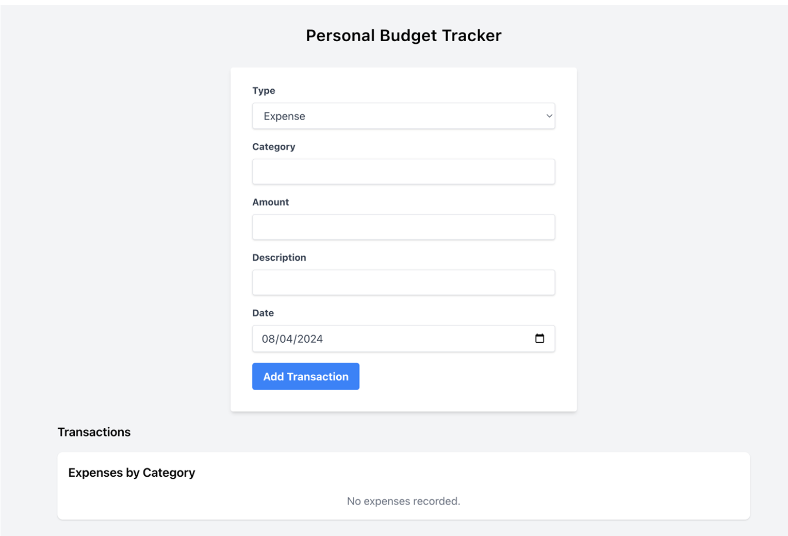
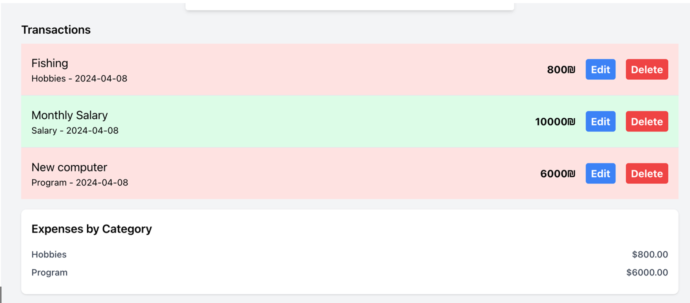

React + TS שיעורי בית

לפניכם משימה לפתח בReact+TS+Tailwind

פרוייקט ניהול תקציב:

יש לייצר אפליקצייה אשר נותנת למשתמשים לנהל את המצב הפיננסי שלהם על ידי מעקב של הכנסות ושל הוצאות.

משתמשים יוכלו להוסיף, לצפות , ולצפות בטרנזקציות לפי קטגוריות.

בנוסף נוכל לראות גם תקציר של הפעילות שלהם.

נ**יהול טרנזקציות:  
**

- הוספת טרנזקציה – משתמשים יוכלו להוסיף טרנזקציות , לציין כמות, סוג הטרנזקציה(הוצאה או הכנסה), קטגוריה, תיאור ותאריך.
- צפייה בטרנזקציות – משתמשים יוכלו לצפות ברשימה של כל הטרנזקציות שלהם, מוצג בסדר כרונולוגי הפוך.
- עריכת/ מחיקת טרנזקציה – משתמשים יוכלו לערוך את תיאור ההוצאה / הכנסה ולמחוק טרנזקציות.

**תקציר תקציב:**

- יש להציג את סך ההכנסות הכולל, סך ההוצאות הכולל, וסך הכל של חסכונות על פי הטרנזקציות שהוכנסו.
- יש לעדכן זאת בזמן את בזמן שטרנזקציות נערכות / נוספות / נמחקות.

**צפייה לפי קטגוריה:**

- יש להציג פירוט של הוצאות על פי קטגוריות, ולהראות כמה סך הכל בוזבז על כל קטגוריה.

דוגמא לאפליקציה:

